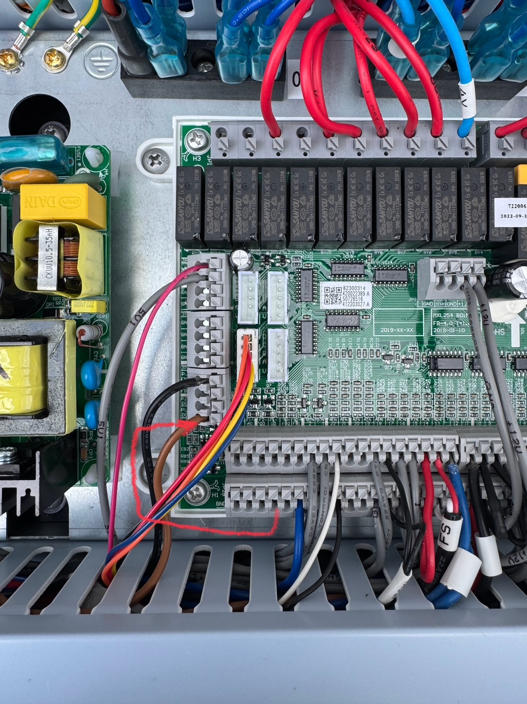

# Umwälzpumpe am Mainboard umklemmen

Bei der FoxAir GL9 ist die PWM-Steuerleitung der Hauptumwälzpumpe im Auslieferungszustand auf **GND/Masse** gelegt. Dadurch läuft die Pumpe praktisch mit **100 %** und kann vom Mainboard nicht in der Drehzahl geregelt werden.

Für eine regelbare Umwälzpumpe muss diese Steuerleitung auf den vorgesehenen PWM-Ausgang des Mainboards umgeklemmt werden.

## Was muss umgeklemmt werden?

Bei der originalen Verdrahtung:

- **brauner Draht (29)** = PWM-Steuerleitung der Umwälzpumpe
- dieser liegt ab Werk auf **GND**
- den braunen Draht auf **P1-DO** umklemmen
- der **blaue Draht bleibt auf GND**

Das folgende Bild zeigt den Sollzustand:

[Bild in voller Größe öffnen](../images/UP_PWM_umklemmen.jpg)

## Zugang zum Mainboard

Um an die Anschlüsse zu kommen:

1. Wärmepumpe **vollständig spannungsfrei schalten**.
2. Den **oberen Deckel der Wärmepumpe** abnehmen.
3. Darunter die **Abdeckung des Elektronikgehäuses** öffnen.
4. Erst danach am Mainboard umklemmen.

> **Achtung – hohe Spannung:** Im Elektronikbereich der Wärmepumpe befinden sich netzspannungsführende Teile. Vor dem Öffnen unbedingt die Stromversorgung abschalten, gegen Wiedereinschalten sichern und Spannungsfreiheit prüfen. Nicht unter Spannung arbeiten.

## Danach

Nach dem Umklemmen kann die Pumpendrehzahl vom Mainboard vorgegeben werden.

Je nach Firmware:

- **V1.2 / V1.3:** feste Drehzahlvorgabe über **P10**
- **ab V3.3:** automatische Pumpenregelung möglich; dafür **P10 = 0 %**

Zusätzlich muss **H31** passend zum verwendeten Pumpentyp eingestellt sein.

Mehr dazu:

[Automatische Regelung der Umwälzpumpe](automatische_up_regelung.md)

## Hintergrund

Die originale Verdrahtung wurde im Photovoltaikforum untersucht und praktisch getestet. Dort ist auch beschrieben, dass der braune Draht (29) von GND auf **P1-DO** gelegt werden muss.

[FoxAir Wärmepumpen – Erfahrungen, Meinungen & Tipps](https://www.photovoltaikforum.com/thread/242531-foxair-w%C3%A4rmepumpen-erfahrungen-meinungen-tipps/?pageNo=13)

> Änderungen an der Verdrahtung erfolgen auf eigenes Risiko. Wer die Anschlüsse nicht eindeutig identifizieren kann, sollte die Arbeiten von einer Elektrofachkraft durchführen lassen.
